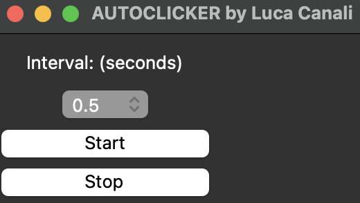

# autoclicker 1.0.1
Autoclicker is a Python application with a graphical user interface. Users can start the autoclicker by providing an interval as input. The development was done using Python 3.10.11 and Visual Studio Code. The application can be executed through VSC or any Python IDE. Inside the 'exec' folder, you will find the executables for different operating systems.

<figure>
  
</figure>

